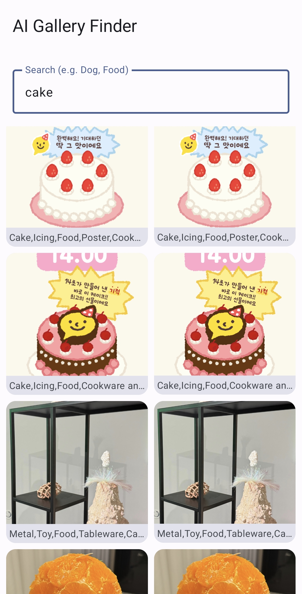

<p align="center"></p>
<p align="center">
  <h1 align="center">🔍 AI Finder</h1>
  <p align="center">
    <strong>Your Gallery, Reimagined with On-Device AI</strong>
    <br />
<table align="center" style="border-collapse: collapse; border: none;">
  <tr style="border: none;">
    <td align="center" style="border: none;">
      
    </td>
    <td align="center" style="border: none;">
      
    </td>
  </tr>
  <tr style="border: none;">
    <td align="center" style="border: none;"><strong>Before</strong></td>
    <td align="center" style="border: none;"><strong>After</strong></td>
  </tr>
</table>
  </p>
</p>

<br/>

## 🚀 Introduction

**AI Finder** is a next-generation Android gallery application that brings the power of Artificial Intelligence directly to your device. 

Forget scrolling through thousands of photos to find that one picture of your dog. **AI Finder** automatically scans your gallery, recognizes objects using **Google ML Kit**, and tags them with relevant keywords—all without a single byte leaving your phone.

Experience the future of photo search. **Fast. Private. Intelligent.**

This project is the result of a final project conducted as part of the Human–AI Collaborative Product and Service Design course offered by the Department of Industrial Convergence at Hanyang University during the Fall 2025 semester.
The supervising professor for this course is Professor Cheol-Hyun Jung of the Department of Industrial Convergence at Hanyang University (inbass@hanyang.ac.kr).
The code and documentation are open source under the MIT License, and may be freely referenced or used; however, all risks arising from such use must be borne solely by the user.


**AI Finder**는 인공지능의 강력한 기능을 사용자의 기기에서 직접 제공하는 차세대 안드로이드 갤러리 애플리케이션입니다.
수천 장의 사진을 하나하나 스크롤하며 반려견 사진을 찾을 필요가 없습니다. **AI Finder**는 **Google ML Kit**을 활용해 갤러리를 자동으로 스캔하고, 사물을 인식해 관련 키워드로 태그를 생성하며, 이 모든 과정은 단 한 바이트의 데이터도 기기 밖으로 전송하지 않고 이루어집니다.
사진 검색의 미래를 경험해 보세요. **빠르고. 안전하며. 지능적입니다.**

본 프로젝트는 한양대학교 산업융합학부 인간-인공지능 협업 제품 서비스 설계 수업(2025년 가을학기)의 기말 프로젝트 활동으로 진행된 결과물입니다. 본 수업의 지도 교수는 한양대 산업융합학부 정철현 교수(inbass@hanyang.ac.kr) 입니다. 코드와 문서는 오픈소스(MIT 라이센스)이므로 자유롭게 참조/사용하시되 사용으로 인한 모든 리스크는 스스로 감당하셔야 합니다.

<br/>

## ✨ Features

*   🧠 **On-Device AI Intelligence**
    *   Powered by Google ML Kit for offline, privacy-focused image labeling.
    *   Recognizes objects like "Dog", "Food", "Sky", "Beach", and more.

*   ⚡ **Instant Search**
    *   Indexed locally using **Room Database** for millisecond-latency search results.
    *   Type "Cat" and see results instantly.

*   🎨 **Modern & Fluid UI**
    *   Built entirely with **Jetpack Compose** for a smooth, beautiful user experience.
    *   Dynamic grid layout with keyword previews.

*   🔒 **Privacy First**
    *   100% offline processing. Your photos never touch a server.

<br/>

## 🛠 Tech Stack

This project is built with modern Android development best practices:

*   **Language**: [Kotlin](https://kotlinlang.org/)
*   **UI**: [Jetpack Compose](https://developer.android.com/jetpack/compose) (Material3)
*   **AI/ML**: [Google ML Kit](https://developers.google.com/ml-kit) (Image Labeling)
*   **Database**: [Room](https://developer.android.com/training/data-storage/room) (SQLite)
*   **Image Loading**: [Coil](https://coil-kt.github.io/coil/)
*   **Async**: [Coroutines](https://kotlinlang.org/docs/coroutines-overview.html) & [Flow](https://kotlinlang.org/docs/flow.html)
*   **Architecture**: MVVM (Model-View-ViewModel)

<br/>

## 📥 Download

Ready to try it out? Download the latest APK below.

<p align="center">
  <a href="https://raw.githubusercontent.com/twen2ty5five-boop/AI-Finder/refs/heads/main/apk/ai-finder.apk">
    
  </a>
</p>

> **Note**: This is a demo application. You may need to allow installation from unknown sources.

<br/>

## 🏁 Getting Started

To build this project locally:

```bash
# 1. Clone the repository
$ git clone https://github.com/YOUR_USERNAME/ai-finder.git

# 2. Open in Android Studio
$ cd ai-finder

# 3. Sync Gradle and Run 'myapplication'
```

<br/>

## 🤝 Contributing

Contributions, issues, and feature requests are welcome!
Give a ⭐️ if you like this project!

